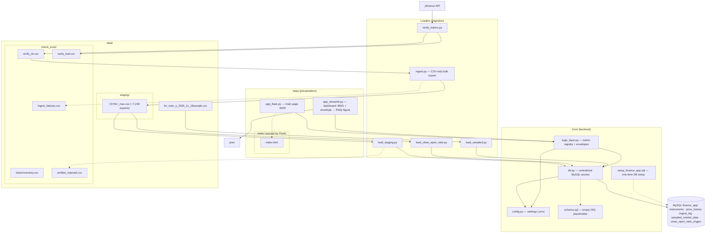
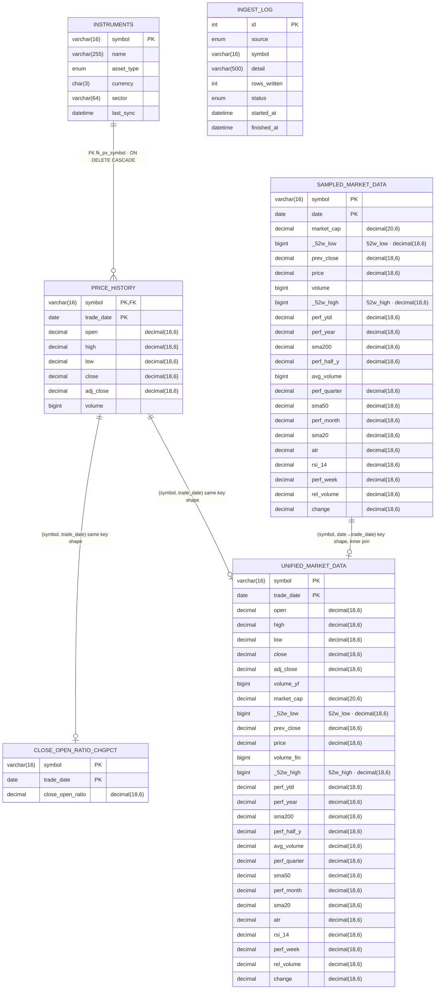

# Architecture — relationships across Apps · Loaders · Core · data/

Nodes are grouped by **category** (Apps · Loaders · Core · data/), mirroring the
code-level relationships of the project.
Solid arrows = direct import/usage (or file handoff). Dashed arrows = failure path / code reuse.
Backend scripts read settings from `config.py` (loaded via `.env`) — one representative edge is shown
(`db --> cfg`); the apps reach `config` **only** through `logic_layer.get_urls()` /
`get_bind_host()` (whitelist accessors — DB credentials never cross that boundary).
Not shown: `venv/`, `__pycache__/` (no relationships), and the root-level non-code files
`.env`, `.env.example`, `requirements.txt`, `.gitignore`.

## Legend

| Category | Node | Role |
|----------|------|------|
| Apps | `app_flask.py` | Flask main page: 3D market chart, serves `static/index.html`, `/api/config` |
| Apps | `app_streamlit.py` | Streamlit dashboard, reuses the same logic-layer metrics; owns `envelope_to_figure` (folded in from the former `app_presenter.py`) |
| Apps | `static/index.html` | Flask template: symbol listbox, Z/Size/Color selects, threshold slider (server-gated — hidden unless Z = `change_bin`) |
| Apps | `static/style.css` | Layout + dark/light themes; `.hidden` utility extended for the topbar label (`.topbar nav > label.hidden`) that gates slider visibility |
| Loaders | `verify_tickers.py` | Existence check of check_exist symbols on yfinance → `data/check_exist/verify_ok.csv` / `verify_bad.csv` |
| Loaders | `ingest.py` | CSV-only bulk export: yfinance → clean → `data/staging/<SYM>_max.csv` (resumable); download failures → `data/check_exist/ingest_failures.csv` |
| Loaders | `load_staging.py` | Loads `data/staging/` CSVs into MySQL; failures → `data/check_exist/verified_rejected.csv` |
| Loaders | `load_close_open_ratio.py` | Computes `close/open` per row from `data/staging/` CSVs into `close_open_ratio_chgpct` (PK `(symbol, trade_date)`, joins to `price_history` by primary key) |
| Loaders | `load_sampled.py` | Self-contained loader: creates `sampled_market_data` (PK `(symbol, date)`) + upserts `data/for_train_y_2025_11_18sample.csv` |
| Core | `logic_layer.py` | THE Logic Layer: metric registry, canonical envelopes (`history`, `market_3d`, `change_binary`); exposes config whitelist accessors `get_urls()` / `get_bind_host()` to the apps |
| Core | `db.py` | Centralized MySQL access (backend only; UIs never touch MySQL directly) |
| Core | `config.py` | Single source of truth for settings (`.env`) |
| Core | `schema.sql` | Empty DDL placeholder, executed by `db.execute_schema()` |
| Core | `setup_finance_app.sql` | One-time MySQL setup: creates DB `finance_app`, user, base tables |

## The ingestion pipelines

**Pipeline A — bulk check_exist** (the checkpoint flow):

`verify_tickers.py` → `data/check_exist/verify_ok.csv` → `ingest.py` → `data/staging/<SYM>_max.csv` → `load_staging.py` → MySQL

- `ingest.py` is CSV-only — it never touches MySQL (loading is `load_staging.py` / `load_close_open_ratio.py`'s job)
- per-symbol CSV = the checkpoint (resume-safe, re-runs the newest file)
- download-time failures are recorded in `data/check_exist/ingest_failures.csv` (append-only ledger)
- failed loads are recorded in `data/check_exist/verified_rejected.csv` (never deleted)
- `data/staging/<SYM>_max.csv` → `load_close_open_ratio.py` → MySQL
  `close_open_ratio_chgpct` (PK `(symbol, trade_date)`, same key shape as
  `price_history`; stores the per-row `close / open` ratio for a
  primary-key `JOIN` against `price_history`).

**Pipeline B — sampled snapshot** (standalone table, no foreign keys):

- `data/for_train_y_2025_11_18sample.csv` → `load_sampled.py` → MySQL
  `sampled_market_data`
  (PK `(symbol, date)` — the CSV's `Ticker` column replaces the old integer
  `ticker_id` identity; the binary 0/1 flag (`change >= threshold -> 1`) is
  computed **at query time** by the `market_3d` logic-layer metric's
  `change_bin` Z channel directly from `sampled_market_data.change` on the
  main page (sampled source; threshold slider 0–100, must be ≥ 0). The old
  `change_y_binary` mirror table and its loader were removed in the 2026-08-12
  dataset swap.

Pipeline A upserts into `instruments` + `price_history` and writes one
`ingest_log` row per loaded CSV, all via `db.py` (Pipeline B writes one
`ingest_log` row per run but targets only `sampled_market_data`). The former
single-symbol `ingest_api.py` path (old Pipeline B, `data/staging/`) was
removed in the ingest merge: `ingest.py` is the only ingest tool.

## MySQL schema — entity-relationship diagram

Six tables. Exactly one declared foreign key (`price_history.symbol →
instruments.symbol`); the other cross-table relationships are
**logical same-key-shape joins** (enforced in SQL by loaders/queries, not by
DB constraints).

**Declared constraints vs. logical joins:**

- **Declared FK (the only one):** `price_history.symbol` → `instruments.symbol`
  (`fk_px_symbol`, `ON DELETE CASCADE`).
- **Logical same-key-shape joins** (enforced in SQL, not by constraints):
  - `close_open_ratio_chgpct` mirrors `price_history` on `(symbol, trade_date)` —
    primary-key `JOIN` used by `load_close_open_ratio.py` / queries.
  - `sampled_market_data` is keyed by `(symbol, date)` — the binary `change_bin`
    flag is computed at query time from its own `change` column (the former
    `change_y_binary` mirror table was removed in the 2026-08-12 dataset swap).
  - `unified_market_data` — the system's primary table, read by every
    logic-layer metric: an inner join of `price_history` ×
    `sampled_market_data` on `(symbol, date = trade_date)`, built by
    `unify_databases.py`. Note `avg_volume` is `DECIMAL(18,6)` here (vs
    `BIGINT` in `sampled_market_data`).
- **`ingest_log`** — standalone audit table (auto-increment `id`); every
  loader writes one row per run; no foreign keys.
- Attribute names rendered with a leading underscore (`_52w_low`,
  `_52w_high`) are display aliases for the digit-leading DB columns
  `52w_low` / `52w_high` — mermaid v11 cannot render attribute names that
  start with a digit; the real column name is shown in the attribute
  comment.
- Full DDL for all six tables: `docs/spec.md` Appendix A.

Notes:
- `verify_tickers.py` is standalone — no imports from other project files.
- UIs (Flask/Streamlit) are presentation-only: all SQL lives behind `logic_layer.py` / `db.py`,
  and app-facing settings (`FTE_MAIN_URL`, `FTE_STREAMLIT_URL`, `FTE_BIND_HOST`) are read from
  `config.py` only via `logic_layer`'s whitelist accessors — never imported directly.