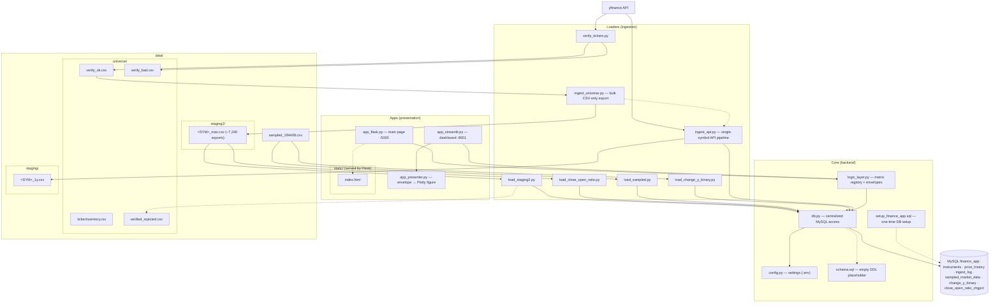

# Architecture — relationships across Apps · Loaders · Core · data/

Nodes are grouped by **category** (Apps · Loaders · Core · data/), mirroring the
code-level relationships of the project.
Solid arrows = direct import/usage (or file handoff). Dashed arrows = failure path / code reuse.
Every script reads settings from `config.py` (loaded via `.env`) — one representative edge is shown.
Not shown: `venv/`, `__pycache__/` (no relationships), and the root-level non-code files
`.env`, `.env.example`, `requirements.txt`, `.gitignore`.

## Legend

| Category | Node | Role |
|----------|------|------|
| Apps | `app_flask.py` | Flask main page: 3D market chart, serves `static/index.html`, `/api/config` |
| Apps | `app_streamlit.py` | Streamlit dashboard, reuses the same logic-layer metrics |
| Apps | `app_presenter.py` | Shared helper: Logic Layer envelope → Plotly figure |
| Apps | `static/index.html` | Flask template: symbol listbox, Z/Size/Color selects, threshold slider |
| Loaders | `verify_tickers.py` | Existence check of universe symbols on yfinance → `data/universe/verify_ok.csv` / `verify_bad.csv` |
| Loaders | `ingest_universe.py` | Bulk full-history export to `data/staging2/` (CSV-only, resumable) |
| Loaders | `ingest_api.py` | Single-symbol yfinance pipeline (pandas + numpy cleaning → staging CSV → MySQL) |
| Loaders | `load_staging2.py` | Loads `data/staging2/` CSVs into MySQL; failures → `data/universe/verified_rejected.csv` |
| Loaders | `load_close_open_ratio.py` | Computes `close/open` per row from `data/staging2/` CSVs into `close_open_ratio_chgpct` (PK `(symbol, trade_date)`, joins to `price_history` by primary key) |
| Loaders | `load_sampled.py` | Self-contained loader: creates `sampled_market_data` + upserts `data/sampled_184408.csv` |
| Loaders | `load_change_y_binary.py` | Self-contained loader: creates `change_y_binary` (PK `(ticker_id, date)`, mirrors `sampled_market_data`) from the same CSV |
| Core | `logic_layer.py` | THE Logic Layer: metric registry, canonical envelopes (`history`, `market_3d`, `change_y_binary`) |
| Core | `db.py` | Centralized MySQL access (backend only; UIs never touch MySQL directly) |
| Core | `config.py` | Single source of truth for settings (`.env`) |
| Core | `schema.sql` | Empty DDL placeholder, executed by `db.execute_schema()` |
| Core | `setup_finance_app.sql` | One-time MySQL setup: creates DB `finance_app`, user, base tables |

## The ingestion pipelines

**Pipeline A — bulk universe** (the checkpoint flow):

`verify_tickers.py` → `data/universe/verify_ok.csv` → `ingest_universe.py` → `data/staging2/<SYM>_max.csv` → `load_staging2.py` → MySQL

- `ingest_universe.py` reuses `clean()` / `fetch_history()` from `ingest_api.py`
- per-symbol CSV = the checkpoint (resume-safe, re-runs the newest file)
- failed loads are recorded in `data/universe/verified_rejected.csv` (never deleted)
- `data/staging2/<SYM>_max.csv` → `load_close_open_ratio.py` → MySQL
  `close_open_ratio_chgpct` (PK `(symbol, trade_date)`, same key shape as
  `price_history`; stores the per-row `close / open` ratio for a
  primary-key `JOIN` against `price_history`).

**Pipeline B — on-demand / manual** (single feed into MySQL):

- `ingest_api.py` → `data/staging/<SYM>.csv` → MySQL (single symbol, e.g. `--symbol AAPL --period 1y`)

**Pipeline C — sampled snapshot** (standalone tables, no foreign keys):

- `data/sampled_184408.csv` → `load_sampled.py` → MySQL `sampled_market_data`
  (PK `(ticker_id, date)`; nullable `symbol` column, currently NULL, ready for
  a later `JOIN` against `instruments`; read by the Flask main page via
  `market_3d` with `source=sampled`).
- `data/sampled_184408.csv` → `load_change_y_binary.py` → MySQL
  `change_y_binary` (PK `(ticker_id, date)`, same key shape as
  `sampled_market_data`; stores the raw `change_y` column only). The binary
  0/1 conversion (`change_y > threshold -> 1`) is computed **at query time**
  by the `market_3d` logic-layer metric's `change_y_bin` Z channel on the
  main page (sampled source; threshold slider 0–100, must be ≥ 0).

Pipelines A and B upsert into `instruments` + `price_history` and write one
`ingest_log` row per run, all via `db.py` (Pipeline C also writes one
`ingest_log` row per run but targets only `sampled_market_data`).

Notes:
- `verify_tickers.py` and `app_presenter.py` are standalone — no imports from other project files.
- UIs (Flask/Streamlit) are presentation-only; all SQL lives behind `logic_layer.py` / `db.py`.